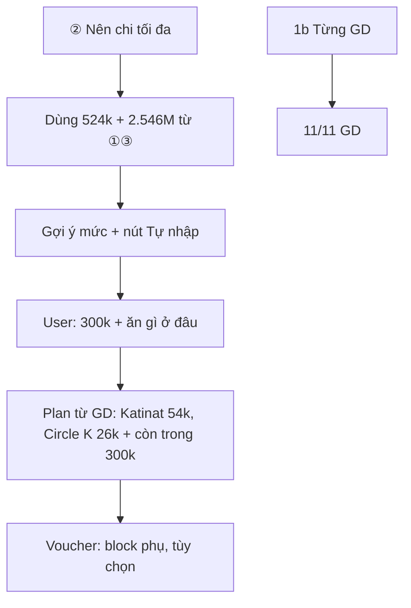

# Workshop — Mổ App AI Thật (cá nhân)

**Thời gian:** 35-45 phút  
**Hình thức:** cá nhân — **tách biệt** phần nhóm (`02-group-spec/` Vinmec)  
**Output:** finding note + sketch `as-is / to-be`

| | |
|---|---|
| **Học viên** | Khoa — 2A202600922 |
| **App** | MoMo — Trợ thủ AI **Moni** |
| **Chủ đề hẹp** | Quản lý chi tiêu cuối tuần |
| **Ngày thử** | 03/06/2026 |

> Phần nhóm (VinmecCare) nằm trong `02-group-spec/`. File này chỉ mô tả workshop **cá nhân** trên Moni.

---

## 1. Chọn một sản phẩm để dùng thử

| Sản phẩm | AI feature | Cách truy cập |
|---|---|---|
| **MoMo — Moni** ✓ | Trợ thủ tài chính: chi tiêu, so sánh kỳ, giao dịch | App MoMo → Moni |
| Vietnam Airlines — NEO | Chatbot vé, hành lý, khiếu nại | Website/Zalo VNA |
| V-App — V-AI | Trợ lý voice/text | App V-App |
| Vinmec — VinmecCare | *(nhóm — không dùng trong workshop cá nhân này)* | — |

## 2. Dùng thử: promise vs reality

- **Product hứa gì?** Moni là trợ thủ AI trong MoMo: hỏi về chi tiêu, so sánh kỳ, xem giao dịch («Hỏi Moni bất cứ điều gì…»).
- **User nào được hứa sẽ được giúp?** Người dùng MoMo muốn kiểm soát chi tiêu, đặc biệt theo kỳ (tuần/cuối tuần).
- **Kỳ vọng AI làm được task nào?** Với chủ đề **cuối tuần**: biết đã chi bao nhiêu, **nên chi tối đa** bao nhiêu, và **gợi ý chi trong hạn mức** (ăn gì, ở đâu).
- **Điểm gãy xuất hiện ở đâu?** Sau khi báo cáo tốt (①③), câu «nên chi tối đa» (②) chỉ mời nhập số → user tự 300k → «ăn gì ở đâu» (④) thành voucher / lỗi / giá chung — **không có kế hoạch chi trong ngân sách** dù Moni đã có data.

### Câu hỏi đã thử (thứ tự chat)

| # | Câu hỏi | Moni trả lời (thực tế) | Đánh giá |
|---|---------|------------------------|----------|
| ① | *cuối tuần vừa rồi tôi chi tổng bao nhiêu* | 30–31/05: **524.100đ**, 11 GD | Đạt |
| 1b | *từng giao dịch là gì* | 5/11 GD, «xem tiếp?» | Gãy — thiếu GD T7 |
| ② | *cuối tuần này tôi nên chi tối đa bao nhiêu* | «Chưa có ngân sách», mời **tự nhập số** | Gãy — không gợi ý từ ①③ |
| ③ | *so với cuối tuần trước nữa… ít hơn hay nhiều hơn* | 23–24/05 **2.546.000đ** vs 524.100đ → ít hơn rất nhiều | Đạt |
| ④a | *300.000đ, gợi ý nên ăn gì ở đâu* | OK 300k + **voucher Phúc Long** | Gãy — lệch intent |
| ④b | *món ăn và giá tiền cụ thể* | **Lỗi:** «Moni chưa thể phản hồi» | Gãy — fail kỹ thuật |
| ④c | (Thử lại) cùng câu | Giá chung VN; Katinat/Circle K 30–70k | Gãy — không plan trong 300k |

### Đối chiếu số (Moni vs ví MoMo)

Cuối tuần 30–31/05/2026: Moni **524.100đ / 11 GD** = cộng lịch sử ví (**khớp**). Khi liệt kê GD: chỉ **5/11** (thiếu 4 GD ngày T7).

**Evidence:**

- Screenshot: `01-invidual-workshop/screenshots/` (chat ①–④, lịch sử GD ví)
- Tham chiếu chi tiết: `D:\AI20K\day5\individuals\momo-moni\` (bản làm đầy đủ trên máy cá nhân)
- **Path yếu nhất:** ② không gợi ý NS → user tự 300k → ④a voucher → ④b lỗi → ④c giá chung

## 3. Vẽ 4 paths

| Path | Câu hỏi cần trả lời | Moni (chủ đề cuối tuần) |
|---|---|---|
| **Happy** | Khi AI đúng và tự tin, user thấy gì? | ① tổng chi 524k/11 GD rõ; ③ so 2.546M vs 524k đúng kỳ — user tin số liệu |
| **Low-confidence** | Khi AI không chắc, có hỏi lại / options / chuyển người? | ② không dùng data đã có để gợi ý mức — chỉ «chưa NS, nhập số» (confidence ẩn, UX như bỏ qua data) |
| **Failure** | Khi AI sai, user biết và sửa thế nào? | ④a lệch intent (voucher); ④b lỗi hệ thống; user phải «Thử lại» — không có sửa plan/ngân sách trong flow |
| **Correction** | User sửa thì có lưu/học lại? | Không thấy — sau lỗi ④b, ④c không giữ ngữ cảnh 300k + merchant user đã chi (54k Katinat, 26k Circle K) |

## 4. Viết finding thành quyết định

```text
Khi user hỏi hạn mức cuối tuần (②) hoặc nêu số (300k) rồi muốn biết ăn gì ở đâu (④),
Moni/product trả voucher Ưu đãi, lỗi tạm thời, hoặc bảng giá chung
thay vì kế hoạch chi có căn cứ từ giao dịch đã có (524k, Katinat, Circle K…),
hậu quả là user không quản lý được chi tiêu cuối tuần trong một luồng — dù báo cáo ①③ đã đúng.
Lỗi thuộc Intent (plan vs promotion) + Data-tool (không nối NS với GD) + UX recovery (retry mất context).
Nên sửa bằng: gợi ý mức từ ①③; plan bữa + «còn X trong 300k» từ GD thật; voucher là block phụ; 11/11 GD khi hỏi chi tiết.
```

**Một câu quyết định sản phẩm:**

> Khi user quản lý chi tiêu cuối tuần (hỏi hạn mức hoặc nêu số rồi muốn biết ăn gì ở đâu), Moni phải nối gợi ý ngân sách với kế hoạch chi có căn cứ từ giao dịch đã có — không dừng ở «chưa có ngân sách», voucher, hay bảng giá chung.

## 5. Sketch as-is / to-be

### As-is (hiện trạng)

```mermaid
flowchart TD
    A[Mở Moni] --> B["① Tổng chi cuối tuần"]
    B --> C["524.100đ, 11 GD — OK"]
    C --> D["1b Từng GD"]
    D --> E["5/11, hỏi xem tiếp"]
    E --> F🔴[Phân trang / thiếu GD T7]
    E --> G["② Nên chi tối đa"]
    G --> H["Chưa NS, nhập số"]
    H --> I🔴[Không gợi ý mức]
    H --> J["③ So 2 cuối tuần — OK"]
    I --> M["④a 300k + ăn gì ở đâu"]
    M --> N["Voucher Phúc Long"]
    N --> O🔴[Lệch intent]
    O --> P["④b Lỗi hệ thống"]
    P --> R["④c Giá chung VN"]
    R --> T🔴[Không gắn 300k / GD user]
```

**Tóm tắt:** Báo cáo tốt → hỏi «nên chi tối đa» chỉ mời nhập số → user tự 300k → «ăn gì ở đâu» → voucher / lỗi / giá chung.

### To-be (đề xuất cá nhân — không phải SPEC nhóm)



**Copy mẫu (④a, sau 300k):**

> Trong **300.000đ**, tuần trước bạn đã **Katinat 54.000đ**, **Circle K 26.000đ**. Gợi ý bữa tương tự — mỗi lựa chọn hiển thị **còn lại** trong ngân sách. [Voucher tùy chọn]

| Lượt | As-is | To-be |
|------|-------|-------|
| ② | Chưa NS, nhập số | Gợi ý từ **524k** + **2.546M** |
| ④a | Voucher | Plan bữa trong **300k** |
| ④b–c | Lỗi → giá chung | Món + giá + còn X; giữ context 300k khi retry |
| 1b | 5/11 GD | **11/11** GD |

## 6. Tự kiểm trước khi nộp

- [x] Có ít nhất 1 screenshot hoặc observation cụ thể.
- [x] Có đủ 4 paths (nêu rõ chỗ product yếu: low-confidence / correction).
- [x] Finding viết thành product decision.
- [x] Sketch có as-is và to-be (mermaid).
- [x] Nêu rõ đây là **cá nhân Moni**, không trùng build slice nhóm Vinmec.

**Liên hệ nhóm:** Finding Moni (coach/plan trong ngân sách) **không** đổi thin SPEC Vinmec trong `02-group-spec/`. Có thể chia sẻ kỹ thuật chung (4 paths, augmentation) khi họp nhóm.

---

## 7. Reflection (chuẩn bị nộp Day 06 — repo cá nhân)

| Mục | Nội dung |
|-----|----------|
| **Vai trò** | Self-use Moni, đối chiếu số ví, viết flow as-is/to-be |
| **Việc đã làm** | 7 lượt chat có thứ tự; xác định path yếu ②→④; 1 quyết định sản phẩm |
| **AI hỗ trợ** | Cursor/AI: soạn flow mermaid, gom bảng — **số liệu và quote lấy từ screenshot thật** |
| **Bài học** | Báo cáo AI đúng chưa đủ; cần test **chuỗi task** (hạn mức → plan), không chỉ từng câu lẻ |
